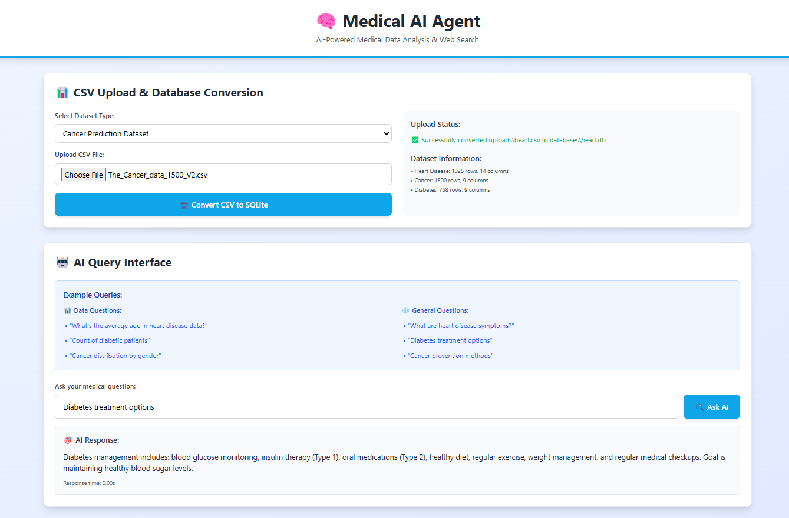
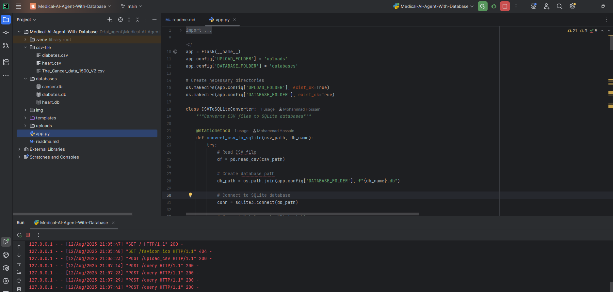

# Medical AI Agent - Setup Instructions

## 📁 Project Structure
```
medical_ai_agent/
├── app.py                 # Main Flask application
├── requirements.txt       # Python dependencies
├── templates/
│   └── index.html        # Frontend template
├── uploads/              # CSV upload directory (auto-created)
└── databases/            # SQLite databases directory (auto-created)
```




## 📦 Requirements.txt
```
Flask==2.3.3
pandas==2.0.3
requests==2.31.0
```

## 🚀 Setup Instructions

### 1. Create Project Directory
```bash
mkdir medical_ai_agent
cd medical_ai_agent
```

### 2. Create Virtual Environment
```bash
python -m venv venv
source venv/bin/activate  # On Windows: venv\Scripts\activate
```

### 3. Install Dependencies
```bash
pip install -r requirements.txt
```

### 4. Create Directory Structure
```bash
mkdir templates uploads databases
```

### 5. Add Files
- Save `app.py` in the root directory
- Save `index.html` in the `templates/` directory
- Save `requirements.txt` in the root directory

### 6. Run the Application
```bash
python app.py
```

The application will be available at: `http://127.0.0.1:5000`

## 🎯 Features

### ✅ CSV Upload & Database Conversion
- Upload CSV files for Heart Disease, Cancer, or Diabetes datasets
- Automatic conversion to SQLite databases
- Real-time status updates

### ✅ Database Query Tools
- **HeartDiseaseDBTool**: Queries heart disease data
- **CancerDBTool**: Queries cancer prediction data  
- **DiabetesDBTool**: Queries diabetes data
- Natural language to SQL conversion

### ✅ Web Search Tool
- **MedicalWebSearchTool**: Provides general medical knowledge
- Handles symptom, treatment, and definition queries

### ✅ Smart AI Routing
- Automatically routes questions to appropriate tools
- Data questions → Database tools
- General questions → Web search tool

## 🔍 Example Queries

### Data Questions (Routes to Database)
- "What's the average age in heart disease data?"
- "Count of diabetic patients"
- "Cancer distribution by gender"
- "Average glucose level in diabetes data"
- "Heart disease by age distribution"

### General Questions (Routes to Web Search)
- "What are heart disease symptoms?"
- "Diabetes treatment options"
- "Cancer prevention methods"
- "What causes diabetes?"
- "Heart disease definition"

## 🗄️ Database Schema

### Heart Disease Dataset
- age, sex, cp, trestbps, chol, fbs, restecg, thalach, exang, oldpeak, slope, ca, thal, target

### Cancer Dataset  
- Age, Gender, BMI, Smoking, GeneticRisk, PhysicalActivity, AlcoholIntake, CancerHistory, Diagnosis

### Diabetes Dataset
- Pregnancies, Glucose, BloodPressure, SkinThickness, Insulin, BMI, DiabetesPedigreeFunction, Age, Outcome

## 🔧 Customization

### Adding New Database Tools
1. Create a new class inheriting from `DatabaseQueryTool`
2. Implement `analyze_question()` method
3. Add to `MedicalAIAgent` class

### Enhancing Web Search
- Integrate with real APIs (SerpAPI, Tavily, Bing)
- Add more sophisticated response formatting
- Implement caching for repeated queries

### Improving Query Routing
- Add more sophisticated NLP for question analysis
- Implement machine learning-based routing
- Add support for complex multi-part questions

## 📝 Notes

- The web search currently uses simulated responses for demo purposes
- In production, integrate with actual search APIs
- Database queries are basic - enhance with more sophisticated SQL generation
- Add error handling and validation as needed
- Consider adding user authentication for production use

## 🎨 UI Features

- **Responsive Design**: Works on desktop and mobile
- **Tailwind CSS**: Modern, clean styling
- **Interactive Examples**: Click to auto-fill queries
- **Real-time Status**: Upload and query progress indicators
- **Smooth Animations**: Loading indicators and transitions